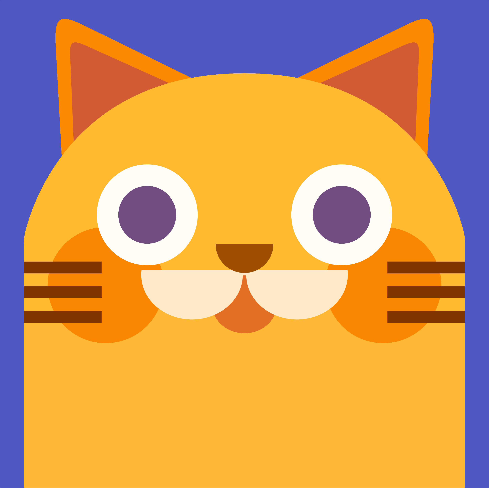
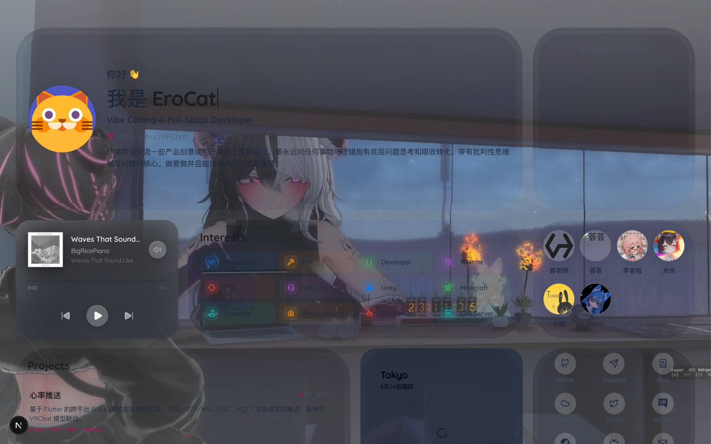
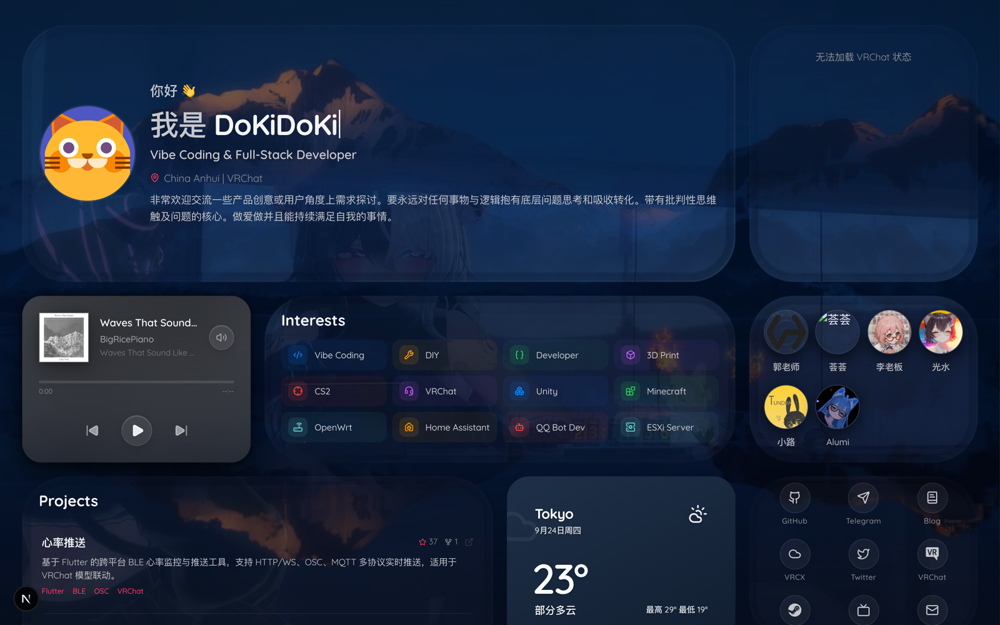

<p align="center">
  
</p>

<h1 align="center">🏠 Bento Homepage</h1>

<p align="center">
  配置驱动 · 共享 WebGL2 Liquid Glass 渲染 · 全静态部署的个人主页<br/>
  Next.js 16 + Tailwind CSS 4 + Framer Motion 12 + GLSL
</p>

<p align="center">
  <a href="https://github.com/Ero-Cat/Bento-Homepage/actions/workflows/deploy.yml"></a>
  <a href="https://iacg.moe"></a>
  <a href="#"></a>
  <a href="#-许可证"></a>
  <br/>
  <a href="#"></a>
  <a href="#">= 20"></a>
  <a href="#"></a>
  <a href="#"></a>
  <a href="#"></a>
</p>

**English** version of this README: [README_EN.md](./README_EN.md)

---

## 📖 目录

- [📺 演示](#-演示)
- [✨ 特性](#-特性)
- [🧩 模块一览](#-模块一览)
- [🧰 技术栈](#-技术栈)
- [🚀 快速开始](#-快速开始)
- [🔧 配置指南](#-配置指南)
- [🎨 自定义外观](#-自定义外观)
- [🔬 Liquid Glass 架构](#-liquid-glass-架构)
- [📁 项目结构](#-项目结构)
- [💡 设计哲学](#-设计哲学)
- [❓ 常见问题](#-常见问题)
- [🚢 部署](#-部署)
- [📜 脚本](#-脚本)
- [🤝 参与贡献](#-参与贡献)
- [📄 许可证](#-许可证)

---

## 📺 演示

**🌐 在线预览 → [iacg.moe](https://iacg.moe)**

真实运行录屏 — 玻璃入场渐显、滚动、指针折射交互与背景轮播：

https://github.com/Ero-Cat/Bento-Homepage/raw/main/assets/demo.webm

<table>
  <tr>
    <td width="50%"></td>
    <td width="50%"></td>
  </tr>
  <tr>
    <th align="center">☀️ 明亮模式 — 清透镜片</th>
    <th align="center">🌙 暗黑模式 — 深色镜片 + 发光边缘</th>
  </tr>
</table>

---

## ✨ 特性

### 🧊 Liquid Glass 渲染

- **共享单画布 WebGL2 壳层** — 全站 `GlassCard` 统一注册到一个 `LiquidGlassCanvas`，经 `bgPass → blurPass → mainPass` 管线渲染折射、Fresnel、色散与 glare，不為每张卡片单独建 GL 上下文
- **清透镜片材质** — 玻璃内部采样的背景比页面遮罩更干净（veil 强度低于 DOM 层），亮色模式是透亮镜片、暗色模式是深色镜片，材质感由 saturation / exposure / tint / sceneCoverage 精确控制
- **对称降采样 blur** — 先 bilinear 降采样再执行分离高斯，模糊半径以 CSS px 锚定、按质量档位换算，任何设备上两轴强度一致且无稀疏核鬼影
- **明暗材质 profile** — 每个 variant（`hero` / `panel` / `media` / `dense` / `immersive`）同时维护 light / dark 两套光学材质，暗色保持透明但更亮，亮色增加暗 counter-rim 提升边缘折射可见度
- **参考式边缘 displacement** — 借鉴 `liquid-glass-react` 的边缘位移贴图思路：向中心压缩的厚边缘折射、RGB 分通道色散、方向性 glare，位移与色散在最外 2 CSS px 平滑归零
- **iOS 式场景重建** — 背景纹理按页面相同的居中 `cover` 裁剪采样；真实纹理 ready 后卡片中心以轻微镜片位移与扩散完整重建同一场景，文本型卡片保留约 8px 等效最低柔化档保证可读性
- **弹性指针响应** — 桌面端仅为当前卡片平滑更新折射与 glare；内容层不位移，粗指针与减少动态效果下自动回退为静态玻璃
- **渐进增强 fallback** — WebGL2 不可用时自动退回 CSS blur / border / shadow 玻璃壳层，内容始终可读

### ⚡ 性能

- **按需渲染调度** — 共享画布只在背景切换、resize、scroll、卡片几何变化、指针 spring 与首屏入场稳定阶段重绘，不常驻空转
- **运行时质量分级** — 按设备 DPR、指针类型、内存与核心数自动切换 blur 降采样与 DPR 上限；卡片绘制经 scissor 裁剪、成本随视口而非卡片数缩放，桌面端不因卡片数量降档
- **低端设备友好** — 省流量、低内存 / 低核心数、移动高 DPR 场景保留完整 Liquid Glass，只降低 DPR 与 blur buffer 成本；场景 FBO 以 1.5× CSS 尺寸封顶、全管线 RGBA8
- **稳定首帧启动** — 启动即创建 1×1 fallback GPU 纹理，真实背景异步加载并经 450ms 渐入替换，绝不卡在 loading 空壳
- **滚动同步架构** — 卡片几何缓存为文档坐标，滚动按浏览器已提交位置投影，避免布局读取进入滚动热路径
- **轻量运行时资源** — 背景 / 照片优先使用 `public/optimized/` 降采样 WebP；Mapbox 视口懒加载；音乐进度条 rAF 直写 DOM 零 React 重渲染

### 🗂 智能卡片

| 卡片 | 亮点 |
|---|---|
| 🎵 网易云播放器 | 真实音频播放 / 切歌 / 进度拖拽，独立 iOS media card 材质 |
| 🎮 VRChat 状态 | VRCX-Cloud API 15 秒轮询，在线状态 / 头像 / 信任等级 / 徽章 |
| 📊 GitHub 热力图 | 无需 Token，过去一年贡献 + 🐍 Snake 巡游动效 |
| 📝 博客 | Halo 2.x API 编辑式文章列表，spring 材质反馈 |
| 🗺️ 足迹地图 | Mapbox Standard，城市标记 + 脉冲弹窗 + **访客 IP 距离计算** |
| 🌤️ 实时天气 | open-meteo 免费无 Token API，Apple Weather 风格动态动效 |

### 🧸 内容与体验

- **配置驱动** — 所有个人信息集中在 `src/config/site.ts` 一个文件，无需改动任何组件
- **多语言问候 & 简介** — 按浏览器语言自动切换（中 / 英 / 日等），`en` 兜底
- **明暗自动切换** — 跟随系统 `prefers-color-scheme`，双套设计令牌，全自动无按钮
- **背景轮播** — 构建时扫描 `public/bg/`，10 秒间隔交叉淡入 + 预加载，DOM 与玻璃共享同一过渡时钟
- **多头像 3D 轮播 / 照片堆叠 / 打字机** — 交错 spring 入场，全物理曲线动画
- **SEO 就绪** — Open Graph / Twitter Card / meta 全部从配置生成
- **GitHub Pages CI/CD** — 推送 `main` 即自动构建部署，纯静态产物可托管在任何服务器

---

## 🧩 模块一览

| 卡片 | 组件 | 说明 |
|---|---|---|
| 👤 个人资料 | `profile-card.tsx` | 多头像 3D 轮播、多语言问候、打字机名称、i18n 简介 |
| 🎵 正在播放 | `now-playing-card.tsx` | 网易云音乐真实播放器，独立 iOS media card 风格 |
| 📸 照片堆叠 | `photo-stack-card.tsx` | 可交互的照片堆叠展示，点击展开 / 收起 |
| 🎮 VRChat | `vrchat-status-card.tsx` | 实时在线状态、头像、信任等级、徽章 |
| 📊 贡献图 | `github-heatmap-card.tsx` | GitHub 过去一年贡献热力图 + Snake 动效 |
| 📝 博客 | `blog-card.tsx` | Halo 2.x 编辑式文章列表、语义元数据与 spring 材质反馈 |
| 🔗 社交链接 | `social-card.tsx` | GitHub / Telegram / Twitter / VRChat 等平台图标 |
| ✨ 兴趣索引 | `skills-card.tsx` | 四列彩色图标索引，静态展示且无伪按钮 hover |
| 🖥️ 硬件清单 | `hardware-card.tsx` | 双栏分类目录、系统色图标与纯文本设备列表 |
| 🚀 项目展示 | `projects-card.tsx` | 编辑式项目列表、GitHub Stars / Forks 与 spring 材质 hover |
| 🤝 友链 | `friends-card.tsx` | 好友头像网格，轻微悬停反馈 |
| 🗺️ 足迹地图 | `map-card.tsx` | Mapbox 互动地图，标记去过的城市，自动 i18n 地名，IP 距离显示 |
| 🌤️ 实时天气 | `weather-card.tsx` | open-meteo 免费天气 API，Apple Weather 风格，动态天气动效 |
| 💻 应用清单 | `software-card.tsx` | 常用软件展示网格 |

---

## 🧰 技术栈

| 类别 | 技术 |
|---|---|
| 框架 | [Next.js 16](https://nextjs.org)（App Router、静态导出） |
| 语言 | TypeScript（严格模式） |
| 样式 | [Tailwind CSS 4](https://tailwindcss.com) |
| 动画 | [Framer Motion 12](https://motion.dev) |
| Liquid Glass | WebGL2 + GLSL（共享 `LiquidGlassCanvas` 四 pass 管线） |
| 图标 | [lucide-react](https://lucide.dev) + 自定义 SVG |
| 地图 | [Mapbox GL JS 3](https://docs.mapbox.com/mapbox-gl-js/) |
| 包管理 | [pnpm 10](https://pnpm.io) |
| 部署 | GitHub Pages + GitHub Actions |

---

## 🚀 快速开始

### 前置要求

- [Node.js](https://nodejs.org) ≥ 20
- [pnpm](https://pnpm.io) ≥ 10

### 安装与运行

```bash
# 克隆仓库
git clone https://github.com/Ero-Cat/Bento-Homepage.git
cd Bento-Homepage

# 安装依赖
pnpm install

# 启动开发服务器（默认 3000 端口）
pnpm dev
```

打开 [http://localhost:3000](http://localhost:3000) 查看效果。修改 `src/config/site.ts` 保存即热更新。

### 构建与测试

```bash
# 静态导出到 ./out，可部署到任意静态服务器
pnpm build

# 运行时 helper 单元测试（liquid glass / 几何投影 / 设计令牌）
pnpm test:unit

# 代码风格检查
pnpm lint
```

> 🔔 没有任何必需的环境变量与 API Token — GitHub 热力图、天气、网易云、VRChat 状态全部使用公开免认证接口；仅足迹地图需要免费的 Mapbox 公开 Token（见[配置指南](#-配置指南)）。

---

## 🔧 配置指南

所有个人内容均通过 **一个文件** 管理：`src/config/site.ts`。

### 个人资料

```typescript
profile: {
    name: "YourName",
    title: "Your Title",
    description: {
        zh: "你的中文简介...",
        en: "Your English bio...",
        ja: "日本語の自己紹介...",
    },
    avatar: "/cat.png",           // 将图片放入 public/
    aliases: ["Name1", "Name2"],  // 打字机循环展示
    location: "Your Location",
}
```

> `description` 使用 `Record<string, string>` 格式，根据浏览器语言自动匹配，`en` 为默认 fallback。

### 卡片标题

```typescript
cardTitles: {
    interests: "Interests",
    hardware: "Hardware",
    projects: "Projects",
    blog: "Blog",
    blogLink: "全部文章",
}
```

### 🎵 网易云音乐

在 `netease.songIds` 中填入歌曲 ID，播放器将随机选择一首展示。

```typescript
netease: {
    songIds: [1814460094, 1408944670, 1854700148],
}
```

> 歌曲 ID 获取方式：在网易云音乐网页版打开歌曲，URL 中 `id=` 后的数字即为歌曲 ID。
> ⚠️ VIP 歌曲无法通过公开外链播放，请使用免费歌曲。

### 📊 GitHub 贡献热力图

```typescript
github: {
    username: "your-github-username",
}
```

> 使用公开 API（jogruber contributions），无需配置 GitHub Token。

### 🎮 VRChat 实时状态

```typescript
vrchat: {
    apiBase: "https://your-vrcx-cloud-api.com",
    userId: "usr_xxxxxxxx-xxxx-xxxx-xxxx-xxxxxxxxxxxx",
    bioLines: 5,
}
```

> 需要自行部署 [VRCX-Cloud](https://github.com/vrcx-cloud/vrcx-cloud) 服务提供状态 API。

### 📝 博客集成

```typescript
blog: {
    url: "https://your-blog.com",   // Halo 2.x 博客地址
    size: 5,                        // 显示最近几篇
}
```

### 兴趣标签

```typescript
interests: [
    { label: "Vibe Coding", icon: "Code2", accent: "blue" },
    { label: "DIY", icon: "Wrench", accent: "orange" },
    { label: "VRChat", icon: "Headset", accent: "purple" },
    ...
]
```

`accent` 可选值为 `blue`、`green`、`orange`、`purple`、`red`、`mint`，运行时自动适配明暗模式。`icon` 为 [lucide-react](https://lucide.dev/icons) 图标名。

### 硬件清单

```typescript
hardware: [
    { category: "Apple", icon: "Apple", accent: "blue", items: ["MacBook Pro M5", "Air Pods 3 Pro"] },
    { category: "Desktop", icon: "Monitor", accent: "green", items: ["R7-9800X3D", "ROG RTX 5090 32G"] },
    ...
]
```

### 社交链接

通过 `enabled: true/false` 控制显隐，无需删除配置。

```typescript
socialLinks: [
    { platform: "github",   url: "https://github.com/your-name",   enabled: true },
    { platform: "telegram", url: "https://t.me/your-name",         enabled: true },
    { platform: "blog",     url: "https://your-blog.com",          enabled: true },
    ...
]
```

**支持平台**：`github` · `telegram` · `discord` · `email` · `twitter` · `linkedin` · `youtube` · `bilibili` · `vrchat` · `steam` · `blog` · `vrcx-cloud`

### 友情链接

```typescript
friends: [
    {
        name: "好友名",
        avatar: "https://example.com/avatar.png",
        url: "https://example.com",
        description: "好友描述（可选）",
    },
]
```

### 🗺️ 足迹地图

```typescript
map: {
    accessToken: "pk.your-mapbox-token",  // Mapbox 公开 Token
    center: [118.0, 35.0],               // 地图中心 [经度, 纬度]
    zoom: 3.5,                           // 初始缩放级别
    markers: [
        { name: "上海", coordinates: [121.47, 31.23], emoji: "🌃" },
        { name: "东京", coordinates: [139.69, 35.69], emoji: "🗼" },
        // ...
    ],
}
```

> Mapbox 免费额度每月 50,000 次加载，个人主页完全足够。
> ⚠️ Token 为公开可见，请务必在 [Mapbox Account](https://account.mapbox.com/) 设置域名白名单限制来源，防止盗用。
>
> 地图卡会自动通过 `ipapi.co` 获取访客城市并计算与各标记城市的直线距离。

### 🌤️ 天气卡片

使用 [open-meteo.com](https://open-meteo.com) 免费 API，无需 Token：

```typescript
weather: {
    city: "合肥",      // 显示的城市名称
    lat: 31.8206,      // 纬度
    lon: 117.2272,     // 经度
}
```

> 坐标来源：在[足迹地图](#️-足迹地图)标记中找到对应城市的 `coordinates`，纬度在前（lat），经度在后（lon）。

### 主题色

```typescript
theme: {
    tintColor: "#fb7185",
    tintColorRGB: "251, 113, 133",
    gradientFrom: "#020617",
    gradientVia: "#0f172a",
    gradientTo: "#1e293b",
}
```

### SEO

```typescript
seo: {
    title: "你的网站标题",
    description: "...",
    keywords: ["developer", "portfolio", "full-stack"],
    ogImage: "/og-image.png",
    siteUrl: "https://your-domain.com",
}
```

---

## 🎨 自定义外观

### 背景图

将图片放入 `public/bg/`，支持 `.jpg` / `.png` / `.webp` / `.avif`。构建时自动扫描，运行时随机轮播（10 秒交叉淡入 + 预加载），玻璃折射会实时同步背景切换。

### 多头像

将头像图片放入 `public/avatar/`，Profile 卡片自动展示 3D 旋转轮播。

### 照片堆叠

将照片放入 `public/photos/`，PhotoStack 卡片以堆叠形式展示，点击展开 / 收起。

### 明暗模式

站点自动跟随系统 `prefers-color-scheme`，无需手动切换。设计令牌定义在 `src/app/globals.css`：

- **明亮模式** — 清透镜片玻璃、深色文字
- **暗黑模式** — 深色镜片玻璃、发光边缘、浅色文字

---

## 🔬 Liquid Glass 架构

### 1. 卡片壳层

- 每个 `GlassCard` 都是一个混合壳层：DOM 负责稳定可见的外缘轮廓与内容命中区域，WebGL 负责折射、Fresnel 与 glare
- 卡片通过 `registerCard()` 注册给共享 `LiquidGlassCanvas`
- 业务组件只声明 `variant`，不直接复制折射、glare、radius 参数
- `NowPlayingCard` 是独立 iOS media card，不注册到共享 liquid-glass 渲染器

### 2. 共享渲染器

- `LiquidGlassCanvas` 使用 `position: fixed` 固定在背景层之上、内容层之下；画布定位只跟随 `visualViewport` 偏移，不把 `window.scrollX/Y` 写入 `left/top`
- 所有卡片共用一个 WebGL2 context；active background texture 在 GL 状态里始终非空（启动用 1×1 fallback，真实纹理 ready 后 450ms 渐入替换）
- 渲染器使用失效驱动调度：背景、窗口尺寸、滚动、卡片几何和首屏入场动画变化时才请求下一帧
- `bgPass` 使用与页面背景一致的居中 `cover` UV 变换；背景切换时与 DOM 共享同一贝塞尔过渡时钟，纹理迟到按已发布时钟追帧
- blur 管线：`glass-bg.glsl`（场景缓冲，≤1.5× CSS）→ `glass-vblur.glsl`（bilinear 降采样 + 垂直高斯）→ `glass-hblur.glsl`（水平高斯）→ `glass-main.glsl`（全画布分辨率合成）
- `mainPass` 三段式模型：外缘色散 + 厚 bevel 折射 + 干净中心；位移与色散在最外 2 CSS px 归零；方向高光与 counter-rim 使用独立窄带
- `mainPass` 对每张卡启用 scissor 裁剪，GPU 只处理该卡的实际屏幕区域
- 桌面交互只保存一张当前卡片的 pointer spring，不经过 React state；pointer cancel、窗口失焦、页面隐藏与滚动重投影都会安全清除或重新命中
- 粗指针和 `prefers-reduced-motion` 关闭持续指针追踪，但保留共享 WebGL 壳层
- 移动端使用 `visualViewport` 解析动态视口尺寸；卡片位置缓存为稳定文档坐标，滚动按已提交位置投影

### 3. 变体系统

- `src/lib/liquid-glass.ts` 是 liquid-glass 视觉参数的单一事实源
- 每个 variant 同时维护 `light` / `dark` 材质 profile（tint、sceneCoverage、saturation、exposure、亮 rim 与暗 counter-rim 增益）
- 当前提供：`hero` · `panel` · `media` · `dense` · `immersive`

### 4. 背景契约

- `BackgroundLayer` 负责把当前背景图 URL 发布到根节点 dataset
- `LiquidGlassCanvas` 只通过这个稳定契约读取背景源，不做 `querySelector + computedStyle` 推断

---

## 📁 项目结构

```
Bento-Homepage/
├── assets/                        # README 演示资源（视频 / 截图）
├── public/
│   ├── cat.png                   # 默认头像
│   ├── CNAME                     # 自定义域名配置
│   ├── avatar/                   # 多头像目录（3D 轮播）
│   ├── bg/                       # 背景图目录（自动轮播）
│   ├── photos/                   # 照片堆叠目录
│   └── optimized/                # 降采样 WebP 运行时资源
├── src/
│   ├── app/
│   │   ├── globals.css           # 设计令牌（明/暗）、玻璃样式、动画关键帧
│   │   ├── layout.tsx            # 根布局、SEO 元数据、背景图扫描
│   │   └── page.tsx              # 首页 — Bento Grid 组装
│   ├── components/
│   │   ├── glass-card.tsx        # 核心卡片壳层（variant + 注册 + fallback）
│   │   ├── bento-grid.tsx        # 响应式网格容器
│   │   ├── background-layer.tsx  # 背景轮播 + 遮罩 + active bg 发布
│   │   ├── liquid-glass-provider.tsx # Client wrapper
│   │   ├── liquid-glass-canvas.tsx   # 共享 WebGL2 画布
│   │   ├── profile-card.tsx      # 头像轮播 + 多语言问候 + 打字机
│   │   └── ...                   # 其余功能卡片组件
│   ├── config/
│   │   └── site.ts               # ⭐ 唯一配置文件（SSoT）
│   └── lib/
│       ├── liquid-glass.ts       # variant / 光学 token 单一事实源
│       ├── liquid-glass-runtime.ts # 质量档位、坐标投影、scissor helper
│       ├── gl-utils.ts           # WebGL2 shader/FBO/texture helper
│       ├── motion.ts             # 弹簧物理预设
│       └── utils.ts              # cn() 类名合并
├── src/shaders/
│   ├── glass-bg.glsl             # 背景 pass（场景缓冲）
│   ├── glass-vblur.glsl          # 降采样 + 垂直 blur pass
│   ├── glass-hblur.glsl          # 水平 blur pass
│   └── glass-main.glsl           # 主 liquid-glass compose pass
├── .github/workflows/
│   └── deploy.yml                # GitHub Actions → Pages 流水线
├── next.config.ts                # 静态导出配置
└── package.json
```

---

## 💡 设计哲学

**为什么又要造一个个人主页？**

1. **真 Liquid Glass，而不是 CSS blur 贴图** — 市面上的 bento 主页大多用 `backdrop-filter: blur()` 模拟毛玻璃。Apple 发布 Liquid Glass 设计语言后，"玻璃"应该有折射、有厚度、有色散、对指针有物理响应。这需要真正的 WebGL 光学管线，而不是一层半透明白色遮罩 — 这就是这个项目存在的理由。

2. **性能是特性，不是妥协** — 每张卡片一个 GL 上下文、常驻 60fps 重绘、滚动时读取布局，这些都是"看起来很美"的实现最常见的死法。本项目从第一天就按共享画布 + 失效驱动渲染 + 文档坐标缓存的架构设计，低端设备只降档、不降级。

3. **一个文件管理一切** — 你不需要理解任何组件代码。个人信息、社交链接、硬件清单、地图标记全部收敛在 `src/config/site.ts`，改完即热更新。

4. **零 Token、零服务器** — 除 Mapbox 免费额度外，所有数据源都是公开免认证 API；构建产物是纯静态文件，GitHub Pages 白嫖到底。

5. **Apple HIG 的克制** — 内容层级优先于装饰：兴趣是静态索引而非伪按钮，列表 hover 只有低噪声色彩反馈，标题不加无说明的计数。玻璃是壳，内容才是主角。

---

## ❓ 常见问题

<details>
<summary><b>WebGL 不可用的设备上会怎样？</b></summary>

自动退回 CSS `backdrop-filter: blur()` + border + shadow 的玻璃壳层，内容完整可读，不出现空白卡片。
</details>

<details>
<summary><b>低端手机会不会卡？</b></summary>

不会降到静态壳层。运行时按省流量、设备内存、核心数、指针类型自动切换质量档位：降低 DPR 上限与 blur buffer 分辨率、场景缓冲封顶 1.5× CSS、全管线 RGBA8。Liquid Glass 的折射 / Fresnel / glare 全部保留。
</details>

<details>
<summary><b>需要配置哪些 Token？</b></summary>

只有足迹地图需要 Mapbox 公开 Token（免费每月 50,000 次加载）。GitHub 热力图、天气、网易云、VRChat 状态全部使用公开免认证 API。
</details>

<details>
<summary><b>网易云音乐放不出声音？</b></summary>

VIP 歌曲无法通过公开外链播放，请使用免费歌曲。ID 获取方式见[配置指南](#-配置指南)。
</details>

<details>
<summary><b>为什么是静态导出而不是 SSR？</b></summary>

个人主页没有服务端逻辑，所有动态数据（GitHub / 天气 / VRChat / 博客）在客户端拉取公开 API。静态导出让站点可以零成本托管在 GitHub Pages / 任何 CDN，没有冷启动、没有服务器账单。
</details>

<details>
<summary><b>怎么自己改玻璃的视觉效果？</b></summary>

改两个地方：`src/lib/liquid-glass.ts`（variant 光学参数、材质 profile 的单一事实源）和 `src/shaders/*.glsl`（渲染管线）。业务组件里没有散落的光学参数。
</details>

<details>
<summary><b>支持手动切换明暗模式吗？</b></summary>

设计上跟随系统 `prefers-color-scheme` 自动切换（Apple HIG 推荐做法），暂不提供手动开关。
</details>

---

## 🚢 部署

### GitHub Pages（推荐）

1. Fork 或克隆此仓库到你的 GitHub
2. 进入 **Settings → Pages → Source** → 选择 **GitHub Actions**
3. 推送到 `main` 分支 — `.github/workflows/deploy.yml` 自动构建并部署

#### 使用自定义域名

1. 修改 `public/CNAME` 为你的域名
2. 在 DNS 提供商添加 CNAME 记录指向 `<username>.github.io`
3. 在 GitHub **Settings → Pages → Custom domain** 填入你的域名
4. 等待 SSL 证书自动颁发，勾选 **Enforce HTTPS**

### 其他静态托管

运行 `pnpm build` 后，将 `./out` 目录部署到任意静态服务器（Vercel、Netlify、Cloudflare Pages 等）。

---

## 📜 脚本

| 命令 | 说明 |
|---|---|
| `pnpm dev` | 启动开发服务器（热更新） |
| `pnpm build` | 构建静态导出到 `./out` |
| `pnpm test:unit` | 运行时 helper 单元测试 |
| `pnpm lint` | 运行 ESLint |

---

## 🤝 参与贡献

- 发现 bug 或有功能建议？欢迎提 [Issue](https://github.com/Ero-Cat/Bento-Homepage/issues)
- PR 前请跑通 `pnpm lint && pnpm test:unit && pnpm build`
- 觉得有用的话，点一个 ⭐ Star 是对作者最好的鼓励

---

## 📄 许可证

[MIT](./LICENSE) © EroCat

> 项目 logo 与演示素材（`public/cat.png`、`assets/`）归 EroCat 所有，遵循 CC BY-SA 4.0。
